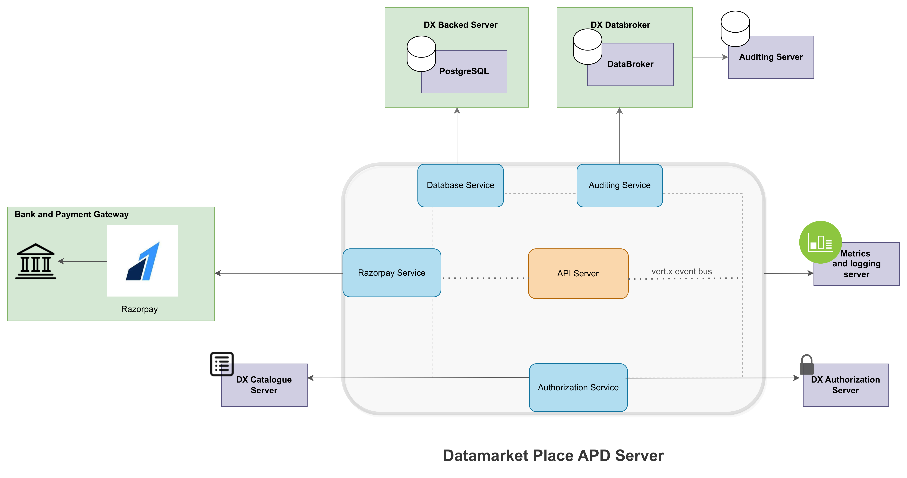

TODO: Add build status, Jenkins Coverage, Unit Tests, Performance Tests, Security tests, Integration Test Links


# iudx-data-marketplace-apd
The data marketplace is IUDX's platform that enables data Providers to host their resources as a product. Likewise, data consumers can buy the products listed by various providers.
The consumers can buy product variants and providers can receive payments through [Razorpay](https://razorpay.com/docs/) as payment gateway. 
The users can interact with DMP APD server using HTTPs requests.

<p align="center">

</p>


## Features
- Provider can onboard to Razorpay as merchant using DMP APD's Linked account creation flow
- Provider can create a product from their resources and then create product-variants by adding various capabilities / constraints to access those resources
- Consumers can fetch latest resources, products, product-variants and filter them accordingly
- Consumers could also create order to buy a product-variant, list the purchases they made
- Providers can create, update, delete their products, variants and list the purchases made against all their resources or products and filter them accordingly
- As soon as the payment is successful and verified a policy is created for the given consumer, against resources in the product variants with their constraints for a specific duration
- Uses webhooks from Razorpay to get real-time information related to transactions and payments
- Secure data access over TLS
- DMP APD is scalable and uses Open source components like Vert.x toolkit for asynchronous operation, RabbitMQ as databroker for auditing, PostgreSQL as Database
- Integration with DX Auth Server for token introspection and DX Auditing Server for metering


## API Docs
Click here to access API docs : [link](https://dmp-apd.iudx.io/)


## Prerequisites
### External Dependencies Installation

DMP APD Server uses the following external dependencies
- PostgreSQL
- RabbitMQ

Find the installations of the above along with the configurations to modify the database url, port and associated credentials in the appropriate sections
[here](SETUP.md)

## Getting Started

### Docker Based
1. Install docker and docker-compose
2. Clone this repo
3. Build the images
   ` ./docker/build.sh`
4. Modify the `docker-compose.yml` file to map the config file you just created
5. Start the server in production (prod) or development (dev) mode using docker-compose
   ` docker-compose up prod `

### Maven Based
1. Install java 13 and maven
2. Use the maven exec plugin based starter to start the server
   `mvn clean compile exec:java@rs-apd-server`

### JAR based
1. Install java 11 and maven
2. Set Environment variables
```
export DMP_APD_URL=https://<dmp-apd-domain-name>
export LOG_LEVEL=INFO
```
3. Use maven to package the application as a JAR
   `mvn clean package -Dmaven.test.skip=true`
4. 2 JAR files would be generated in the `target/` directory
    - `iudx.data.marketplace-cluster-0.0.1-SNAPSHOT-fat.jar` - clustered vert.x containing micrometer metrics
    - `iudx.data.marketplace-dev-0.0.1-SNAPSHOT-fat.jar` - non-clustered vert.x and does not contain micrometer metrics

#### Running the clustered JAR

**Note**: The clustered JAR requires Zookeeper to be installed. Refer [here](https://zookeeper.apache.org/doc/r3.3.3/zookeeperStarted.html) to learn more about how to set up Zookeeper. Additionally, the `zookeepers` key in the config being used needs to be updated with the IP address/domain of the system running Zookeeper.

The JAR requires 3 runtime arguments when running:

* --config/-c : path to the config file
* --hostname/-i : the hostname for clustering
* --modules/-m : comma separated list of module names to deploy

e.g. `java -jar target/iudx.data.marketplace-cluster-0.0.1-SNAPSHOT-fat.jar  --host $(hostname) -c configs/config.json -m iudx.data.marketplace.postgres.PostgresVerticle,iudx.data.marketplace.product.ProductVerticle
,iudx.data.marketplace.authenticator.AuthenticationVerticle ,iudx.data.marketplace.consumer.ConsumerVerticle,iudx.data.marketplace.auditing.AuditingVerticle`

Use the `--help/-h` argument for more information. You may additionally append an `DMP_APD_JAVA_OPTS` environment variable containing any Java options to pass to the application.

e.g.
```
$ export DMP_APD_JAVA_OPTS="-Xmx4096m"
$ java $DMP_APD_JAVA_OPTS -jar target/iudx.data.marketplace-cluster-0.0.1-SNAPSHOT-fat.jar ...
```

#### Running the non-clustered JAR
The JAR requires 1 runtime argument when running:

* --config/-c : path to the config file

e.g. `java -Dvertx.logger-delegate-factory-class-name=io.vertx.core.logging.Log4j2LogDelegateFactory -jar target/iudx.data.marketplace-dev-0.0.1-SNAPSHOT-fat.jar -c configs/config.json`

Use the `--help/-h` argument for more information. You may additionally append an `DMP_APD_JAVA_OPTS` environment variable containing any Java options to pass to the application.

e.g.
```
$ export DMP_APD_JAVA_OPTS="-Xmx1024m"
$ java $DMP_APD_JAVA_OPTS -jar target/iudx.data.marketplace-dev-0.0.1-SNAPSHOT-fat.jar ...
```
### Testing

### Unit tests
1. Run the server through either docker, maven or redeployer
2. Run the unit tests and generate a surefire report
   `mvn clean test-compile surefire:test surefire-report:report`
3. Reports are stored in `./target/`

## Contributing
We follow Git Merge based workflow
1. Fork this repo
2. Create a new feature branch in your fork. Multiple features must have a hyphen separated name, or refer to a milestone name as mentioned in Github -> Projects
3. Commit to your fork and raise a Pull Request with upstream

## License
[View License](./LICENSE)

