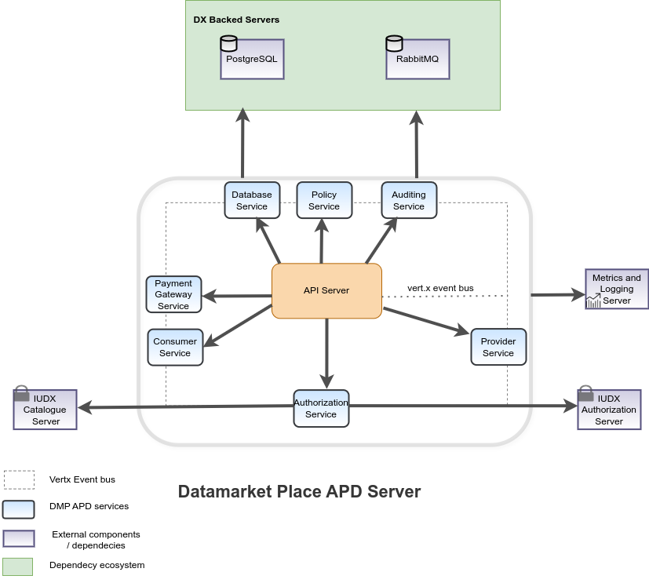

[%2520pipeline%2F)](https://jenkins.iudx.io/job/iudx%20DMP%20APD%20(master)%20pipeline/lastBuild/)
[%2520pipeline%2F)](https://jenkins.iudx.io/job/iudx%20DMP%20APD%20(master)%20pipeline/lastBuild/jacoco/)
[%2520pipeline%2F&label=unit%20tests)](https://jenkins.iudx.io/job/iudx%20DMP%20APD%20(master)%20pipeline/lastBuild/testReport/)
[%2520pipeline%2F&label=security%20tests)](https://jenkins.iudx.io/job/iudx%20DMP%20APD%20(master)%20pipeline/lastBuild/zap/)
[%2520pipeline%2F&label=integration%20tests)](https://jenkins.iudx.io/job/iudx%20DMP%20APD%20(master)%20pipeline/lastBuild/Integration_20Test_20Report/)

# dx-data-marketplace-apd

The data marketplace is Data Exchange's platform that enables data Providers to host their resources bundled as a product.
Likewise, data consumers can buy the products listed by various providers. The consumers can make purchases against a
product variant of the any product. Providers can receive payments through [Razorpay](https://razorpay.com/docs/) which
is implemented as the payment gateway.
All users can interact with the data marketplace API server using HTTPs requests.

## Features

- Provider can onboard to Razorpay as merchant using the marketplace's Linked Account Creation flow.
- Provider can create a product by bundling their resources and then create product-variants by adding various
  capabilities / constraints to access those resources.
- Consumers can fetch latest resources, products, product-variants and filter them accordingly.
- Consumers can place orders and make payments against an order via Razorpay.
- Consumers can list all the purchases they have made.
- Providers can also list the purchases made against all their resources or products and filter them accordingly.
- When a payment is successful and verified, resource access policies are created for the given consumer.
- Razorpay interacts with the server using webhooks to feed real-time information related to transactions and payments
- Secure data access over TLS
- The data marketplace is scalable and uses open source components like Vert.x toolkit for asynchronous operation,
  RabbitMQ as a databroker for auditing requests, PostgreSQL as a database
- Integration with DX Catalogue Server for understanding resource metadata, DX Auth Server for token introspection and
  DX Auditing Server for metering

# Explanation
## Understanding DMP APD
- The section available [here](./docs/Solution_Architecture.md) explains the components/services used in implementing the DMP-APD server
- To try out the APIs, import the API collection, postman environment files in postman
- Reference : [postman-collection](src/test/resources/DX-Data-Marketplace-APIs.postman_collection.json), [postman-environment](src/test/resources/postman-environment.json)

# How To Guide
## Setup and Installation
Setup and Installation guide is available [here](./docs/Setup-and-Installation.md)

# Reference
## API Docs
API docs are available [here](https://redocly.github.io/redoc/?url=https://raw.githubusercontent.com/datakaveri/iudx-data-marketplace-apd/refs/heads/main/docs/openapi.yaml)

## FAQ
FAQs are available [here](./docs/FAQ.md)

