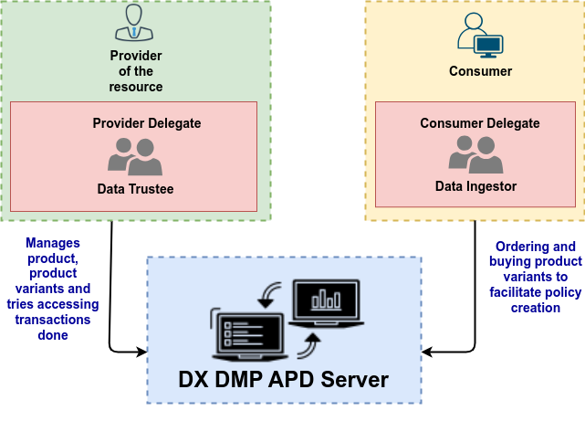

# Tokens, Users and Roles
## Tokens used in DX
- Tokens for a user could be created using DX AAA Server API : [link to the API docs](https://authorization.adex.org.in/apis#tag/Token-APIs/operation/post-auth-v1-token). The token used in DX are :

| Token             |                                                                                     Purpose                                                                                     | Users                                                                      |
|:------------------|:-------------------------------------------------------------------------------------------------------------------------------------------------------------------------------:|:---------------------------------------------------------------------------|
| DX Identity token |                                          Serves as an identifier of the user to the server to access the ACL-APD Server's capabilities                                          | Provider, provider delegate, consumer, consumer delegate, cos admin, admin |
| Keycloak token    | Access token as bearer credential is generated by Keycloak by providing the client's email ID and password and then adding bearer to the access token : `bearer <access-token>` | DX AAA Server, Users                                                       |
| Access token      |                                                                    To get access to resource, resource group                                                                    | Provider, provider delegate, consumer, consumer delegate                   |

## Tokens accepted in DX DMP APD Server
Tokens accepted by the DX DMP APD Server are the DX Identity token and keycloak token. Identity token is used for user specific APIs whereas the bearer token or Keycloak token is used for the Verify API.
Providers, Consumers and delegates of providers and consumers are allowed to access the following APIs using the mentioned token:

| API                            |                          Users                           | Token              |
|:-------------------------------|:--------------------------------------------------------:|:-------------------|
| Create Order                   |               Consumer, consumer delegate                | DX Identity token  |
| Consumer list resource         |               Consumer, consumer delegate                | DX Identity token  |
| Consumer list provider         |               Consumer, consumer delegate                | DX Identity token  |
| Consumer list purchases        |               Consumer, consumer delegate                | DX Identity token  |
| Consumer list products         |               Consumer, consumer delegate                | DX Identity token  |
| Consumer list product variants |               Consumer, consumer delegate                | DX Identity token  |
| Verify Payment                 |               Consumer, consumer delegate                | DX Identity token  |
| Create Product                 |               Provider, provider delegate                | DX Identity token  |
| Delete Product                 |               Provider, provider delegate                | DX Identity token  |
| List Product                   |               Provider, provider delegate                | DX Identity token  |
| Provider list purchases        |               Provider, provider delegate                | DX Identity token  |
| Create Product variant         |               Provider, provider delegate                | DX Identity token  |
| Fetch Product variant          |               Provider, provider delegate                | DX Identity token  |
| Update Product variant         |               Provider, provider delegate                | DX Identity token  |
| Delete Product variant         |               Provider, provider delegate                | DX Identity token  |
| Create Linked Account          |               Provider, provider delegate                | DX Identity token  |
| Update Linked Account          |               Provider, provider delegate                | DX Identity token  |
| Fetch Linked Account           |               Provider, provider delegate                | DX Identity token  |
| Verify Policy                  |                      DX AAA Server                       | Keycloak token     |
| Fetch Policies                 | Provider, provider delegate, consumer, consumer delegate | DX Identity token  |
| Check Policy                   |               Consumer, consumer delegate                | DX Identity token  |

## Users and Roles
All registered users of DX can access the DX DMP APD Server. The DX DMP APD Server identifies the user based on the token information which is provided by DX AAA Server. 

How is the user considered as a consumer, provider or delegate?
- While decoding the token at the DX ACL APD Server, the **role** in token fetched from DX AAA Server and then the following rules is applied to identify the user
  - A user is considered as a **provider** if **role** is **provider** 
  - A user is considered as a **consumer** if **role** is **consumer** 
  - A user is considered as a delegate of the consumer if **role** is **delegate** and **drl** is **consumer**
  - A user is considered as a delegate of the provider if **role** is **delegate** and **drl** is **provider**

## Terminologies and Definitions

- **Policy** : An agreement or contract between the owner of the resource to allow the consumer to access the resource.
- **Product** : Resource(s) could be packaged as a product by giving it a unique name to publish it on the DX Data marketplace APD. 
- **Constraints** : (or capabilities) Are different methods in which information related to resource can be fetched.
- **Product Variant** : The variant of a given product that is associated with a specific price, specific capability, duration of expiry, variant name is a product variant.
- **Expiry in months** : The product variant is associated with duration. When a consumer makes a successful purchase against a product variant, a policy is created. The expiry of that policy is created based on the product variant's expiry in months from the current time.
- **Merchant** : A provider is a merchant who is onboarded on DX platform, Payment Gateway, DX DMP APD Server.  
- **Sub merchant** : DX DMP APD Server acts a sub merchant platform to the respective payment gateway.
- **Linked Account** : To transfer funds to merchants, bank accounts from consumers and to perform operations like initiating refunds by providers, settlement.
- **Razorpay** : Razorpay is a payment gateway service through which provider could be onboarded, provider can have access to their dashboards, payment settlements can be made in T+2 days and consumer could pay in multiple payment methods in a secured way.
- **Policy Status** : Policy could be in either of these states - active, deleted or expired.
- **Payment Status** : The payment status can be in either of these states - pending, succeeded, failed. 
- **Delegate** : Consumer or provider appointed user who could act on behalf of the delegator.
- **Resource Server URL** : A resource, user is associated with DX Resource Server URL based on which they could access to the APIs offered by a server in specific DX environment.
- **Access Policy** : A resource can be differentiated based on their access policies like Open, Secure and PII data
- **Invoice** : Invoice contains all the information related to a specific purchase, ex: payment information, variant name, price, IDs of product variant, product, order, consumers, providers, resources etc.,
- **Order** : Order links the payment to the product variant. 
- **Payment** : After the payment information is filled and a button is clicked for further processing a payment is created. The payment goes through verification, authorization steps at the banks. If the payment is successful, the funds are transferred from consumer's to provider's account.
- **Webhook status** : The states that are being captured by an asynchronous call being made to DX DMP APD server are : order.paid, payment.failed
- **Route** : Method through which payments made through Razorpay are managed, settled and refunded by creating linked account.
- **Purchase** :  When the consumer proceeds to checkout, after the order is created, to buy the product variant and fills up the payment information but no processing has been done the payment.
