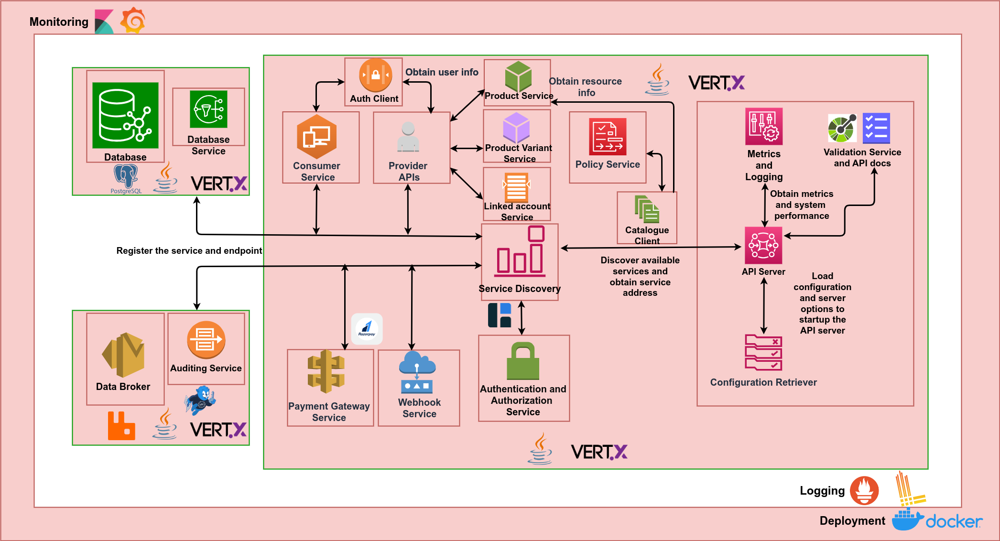

## Solution Architecture
The following block diagram shows different components/services used in implementing the DX DMP APD Server.

The above setup allows specific high load containers/services to scale with ease. Various services of the server are detailed in the sections below.

### API Server
An API server is an HTTPS Web Server and serves as an API gateway for actors (consumers, providers, provider delegates, consumer delegates) to interact with the different services provided by the DX DMP APD Server.
These services (as described below) may be database read/write services, databroker audit log publishing service, etc.
It is also responsible for calling the DX Auth Server (via the authorization service) to authenticate and authorize access to users.

### Database Module
The Database Search Service is called by the API Server to serve consumer data requests. Consumers may request for data by querying for it in accordance with the API specification obtained with /apis endpoint.

A number of search queries are supported including -
- Operation based search:
  - Purchase (with payment status : successful, failed, pending) could be searched and filtered further based on a specific resource or product
  - After creating the linked account successfully, the provider’s linked account related information is queried from both database and the payment gateway to display the desired response
  - Policy related information could be displayed by querying the database after the policy is successfully against a successful purchase
- Item or component based search :
  - Resources with respect to a specific registered provider is fetched from DX Catalogue Server and is stored and queried from the database associated with DX DMP APD Server for further filtering based on resourceId, providerId
  - Provider that are registered on DX DMP APD could be shown to the consumers and provider information could be further filtered based on the providerId from the list of providers
  - Product related information could be queried from the database and could be further filtered based on the resourceId and providerId
  - Product variant related information like product variant name, productId, resources, provider, price, expiry, resource capability etc., is stored in the database and active product variants are listed and could be queried further based on the productId

### Auditing Service
The Data broker service is used by the API Server to publish audit logs to DX Auditing Server when a linked account is created or updated, when policy is successfully created against a successful payment.
The ancillary services handled by the data broker service to facilitate subscription of data are

### Authentication, Authorization Service
The authentication service interacts with the DX Authentication server to validate identity tokens provided by consumer, providers, provider delegates, consumer delegates. Authorization Service also checks if a given user has access to the requested endpoint to enhance the security of the data being served through the endpoint.

### Consumer Service
The Consumer Service fetches some or all resources, providers, products, active product variants available to the consumer on DX Data Marketplace. It also helps in creating an order for the consumer against a product variant. After the purchase is made, based on whether the purchase is pending, successful and failed, invoice related information could be fetched using consumer service.
Whenever the consumer wants to buy a product-variant, an order is created against the product variant using the create order API. Then using the Razorpay key, this order ID, a checkout form is created that is integrated
with Razorpay, to allow consumers to use various methods for making the payment.

### Provider Module
The Provider APIs connect with product service to create, fetch and delete a product. It connects with product variant service to perform CRUD operations on product variants, fetch invoice or purchase related information could be fetched and displayed. Initially, the providers are onboarded with a payment gateway by creating a linked account and further a provider is helped in creating the product after the payment gateway related account has status as activated.

### Policy Service
The Policy Service helps in creating and fetching a policy after a successful payment is made by the consumer through the payment gateway. If there is an existing policy for resources in the product variant, it helps in displaying a message to the consumer to help make an informed decision to make the purchase to buy or not buy the product variant. DX Auth Server could generate access tokens based on the existence of policy by calling the DMP APD and providing an orderId (could be fetched list purchase) in the context field of the request body while using verify API.

### Webhook Service
The Webhook service helps in recording the transactions based on if the purchase is successful or not. If the purchase is successful, the order paid is recorded and policy creation for the order is triggered. The APIs related to this service are called asynchronously by Razorpay whenever a payment is failed or when an order is successful at the payment gateway’s end.

### Payment Gateway Service
This service, by using Razorpay, helps in creating order and helps in transferring the amount from the order to the respective product variant’s provider. Verifies if a payment signature and webhook signature  is legit, helps in creating, fetching, updating linked account for the provider in order to onboard them on Razorpay with respect to DX DMP APD platform, accepts terms and conditions on behalf of the provider after creating a linked account, checks if their Razorpay account is activated after the provider completes their KYC at the payment gateway’s end.
